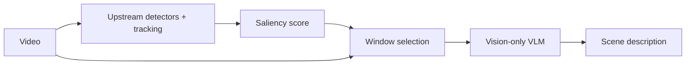

# Anchoring Bias in Vision-Language Models

[](https://doi.org/10.5281/zenodo.19557722)

Companion repository for an empirical investigation of how structured detection data suppresses visual reasoning in vision-language models. All raw prompts, images, and model responses are included verbatim — nothing is summarized or paraphrased.

> **Prefer a plain-language walkthrough?** See [`overview.md`](overview.md) — it has the original narrative intro, the three-patterns summary in blog-post voice, and a tabular index of all references.

## Abstract

Hybrid perception pipelines increasingly feed the output of upstream object detectors (YOLO, tracking, pose) into a vision-language model to obtain semantic understanding. We show this "more context is better" intuition is wrong for scene-description tasks: providing a VLM with lossy intermediate representations from upstream models systematically introduces anchoring bias, and the *delivery channel* of those representations dominates the magnitude of the effect. On a controlled 10-second surveillance clip of a shoplifting event, we run seven conditions varying only how YOLOv8 + BoT-SORT detections are delivered — text JSON, visual bounding-box overlays, or a cross-modal ID-map — and score Gemini 3 Flash Preview and Gemini 2.5 Flash responses on a Visual-Detail / Data-Narration (VD/DN) rubric. Findings: (1) same bounding boxes delivered as text collapse VD/(VD+DN) to 53%, as visual overlays retain 69%, and as a cross-modal reference scheme collapse to 47% — an ordering not reducible to token count; (2) plausibly-positioned fabricated detections are adopted unchallenged (a 0.44-confidence fake cell phone near the subject's hand is adopted in every injection condition on both models); (3) VD/(VD+DN) degrades monotonically with metadata density, with no "sweet spot." All raw prompts, model responses, images, scoring rubric, and analysis are included. n=1 per condition, one primary scene, two models from one family — preliminary but consistent.

## Core claim

> **Feeding a VLM lossy intermediate representations from upstream detectors introduces anchoring bias that systematically degrades visual reasoning, and the *channel* through which those representations are delivered dominates the magnitude of the degradation.**

## Blog posts

- **Part 1: The More You Tell It, The Less It Sees** — defines anchoring bias in VLMs, presents the controlled experiment, and gives engineering guidance. *Under publication review.* [LINK]
- **Part 2 (upcoming): The Failure Catalog** — identity misattribution and entity fabrication under stress-test conditions.

## Method

### The delivery-channel trilemma

Any pipeline that wants to pass spatial detection information from an upstream model to a downstream VLM has exactly three channels:

- **Text.** Serialize detections (class, bbox, confidence, carrying, …) as JSON in the prompt.
- **Visual.** Draw bounding boxes with class labels onto the image.
- **Cross-modal.** Draw ID labels on the image and provide a text map from ID → attributes.

We test all three under matched information content. All three anchor the VLM away from direct visual reasoning. There is no free channel.

### Two-pass architecture as the engineering implication

Because every delivery channel costs visual reasoning, upstream detection data should not be fed as context to the VLM that describes the scene. The robust alternative is a two-pass pipeline: use detections to *select* salient windows, then describe them with the VLM from pixels alone.



### Design

- **Scene.** 85–95s of a retail-surveillance clip: a woman in a red top conceals a dark garment in her shoulder bag (~90s) and walks away.
- **Visual input (constant).** A 3×3 temporal grid of uniformly-sampled clean frames + a center full-resolution frame (848×480). Only the center frame's overlay state varies by condition.
- **Structured data (variable).** Real detections from YOLOv8-L + BoT-SORT. Conditions C/E/G additionally inject three fabricated detections at moderate confidence (0.44–0.52).
- **Prompt.** Identical across all conditions, including the instruction *"use the visual frames as ground truth when signals seem ambiguous"* — an instruction not reliably followed under anchoring.
- **Models.** Gemini 3 Flash Preview (primary for EXP1), Gemini 2.5 Flash (secondary; primary for gradient and failure-catalog experiments). All calls via Google GenAI Python SDK.
- **Scoring.** Visual Detail (pixel-only observations) vs Data Narration (restatement/citation of provided data), LLM-assisted and reviewed by a single human scorer. See [`scoring/rubric.md`](scoring/rubric.md).

Full methodology in [`methodology.md`](methodology.md).

## Key results

### EXP1 — delivery channel dominates (Gemini 3 Flash Preview)

Same bounding-box information, three delivery channels, three outcomes.

| Condition | VD/(VD+DN) | Shoplifting detected? | Fake phone adopted? |
|-----------|-----------|----------------------|-------------------|
| Baseline (no data) | **100%** | Yes — confident, precise timing | — |
| D (visual bbox) | **69%** | Yes — "consistent with shoplifting" | — |
| C (text bbox + fake) | **60%** | Hedged — "notable for security" | Yes |
| E (visual bbox + fake) | **57%** | No — "typical shopper" | Yes |
| B (text bbox) | **53%** | Hedged — "noteworthy" | — |
| F (crossmodal) | **47%** | No — fabricated movement | — |
| G (crossmodal + fake) | **40%** | No — "No suspicious activity" | Yes |

**Channel ranking:** visual overlays (69%) > text coordinates (53%) > cross-modal ID map (47%). Cross-modal anchors harder than text despite *fewer* text tokens (328 vs 353), so the effect is not reducible to token count.

### Every metadata field has a cost — monotonic degradation

| Level | Data density | VD/(VD+DN) | Shoplifting detected? |
|-------|-------------|-----------|----------------------|
| G0 | None | ~100% | Yes |
| G1 | Track IDs + carrying labels | ~85% | Yes |
| G2 | + position samples | ~65% | Yes (timing drifts) |
| G3 | Full per-10-frame tracking | ~45% | Yes (late, heavy citation) |
| G4 | Dense (per-3-frame) | ~20% | **No** |

No sweet spot on this scene-description task.

### Fabricated detections pass unchallenged when plausible

| Fake entry | Location | Adopted? |
|-----------|---------|---------|
| Fake person | empty aisle | Never |
| Fake handbag | bare floor | Never |
| Fake cell phone, 0.44 conf | near subject's hand | Every injection condition, both models |

The rejection criterion is *"does the image actively disprove this?"*, not *"can I see this?"*.

Full tables (cross-model comparison, token-ratio analysis, failure-catalog stress tests) in [`results_summary.md`](results_summary.md).

## Repository structure

| You want to see... | Go to... |
|-------------------|----------|
| Plain-language walkthrough + tabular reference index | [overview.md](overview.md) |
| How the experiment was designed | [methodology.md](methodology.md) |
| Key results tables | [results_summary.md](results_summary.md) |
| How VD/DN was scored | [scoring/rubric.md](scoring/rubric.md) |
| All scores in one file | [scoring/scores.csv](scoring/scores.csv) |
| The 7-condition channel experiment (Part 1) | [experiments/exp1/](experiments/exp1/) |
| The data-density gradient (Part 1, Pattern 3) | [experiments/gradient/](experiments/gradient/) |
| Identity misattribution & entity fabrication (Part 2) | [experiments/failure_catalog/](experiments/failure_catalog/) |
| Scripts used to generate inputs and run experiments | [scripts/](scripts/) |

### EXP1 condition reference

| Code | Center image | Bbox delivery |
|------|-------------|--------------|
| 0 (baseline) | Clean | None |
| B | Clean | Text JSON |
| C | Clean | Text JSON (+ 3 fakes) |
| D | Bboxes drawn | Visual overlay |
| E | Bboxes drawn (+ 3 fakes) | Visual overlay |
| F | ID labels drawn | Cross-modal (image IDs + text map) |
| G | ID labels drawn (+ 3 fakes) | Cross-modal (image IDs + text map) |

### Failure catalog experiments

| Experiment | What was manipulated | Blog section |
|-----------|---------------------|-------------|
| wrong_suspect | Tracking data for only T1 (a mannequin). No data for T2 (shoplifter). | Part 2: Identity misattribution |
| ghost | T2's tracking data replaced with fabricated frozen-position data. | Part 2: Entity fabrication |

## Reproducibility

All experiment inputs (images, prompts, text data) and outputs (raw model responses, scores) are included. To replicate on your own model:

1. Pick an experiment directory (e.g., `experiments/exp1/`).
2. For each condition, send the grid image + center image + prompt + text data to your VLM.
3. Score the response using the [VD/DN rubric](scoring/rubric.md).
4. Compare with the responses in `responses/` and the scores in [`scoring/scores.csv`](scoring/scores.csv).

The scripts in `scripts/` generated the experiment inputs but require the full YOLO pipeline to run. You do not need them for replication — all generated artifacts are already in the repo.

## Caveats

This is an engineer's investigation, not a peer-reviewed study. Two models from one family, one primary scene, n=1 per condition. Manual VD/DN scoring with a single reviewer; no inter-rater reliability. The "use visual frames as ground truth" prompt instruction may itself interact with anchoring in ways not isolated here. The patterns are consistent and reproducible within this scope — they are not a proof of universality. Replicate before you ship.

## Citation

If you use this work, please cite:

```bibtex
@dataset{dubey2026anchoring,
  author    = {Dubey, Mradul},
  title     = {The More You Tell It, The Less It Sees: Anchoring Bias in Vision-Language Models},
  year      = {2026},
  publisher = {Zenodo},
  doi       = {10.5281/zenodo.19557722},
  url       = {https://doi.org/10.5281/zenodo.19557722}
}
```

A [`CITATION.cff`](CITATION.cff) file is also provided so GitHub's "Cite this repository" widget and tools like Zotero can import the metadata directly.

## Related work

Short thematic prose. Each cited paper is placed in direct relation to the present findings.

**Anchoring in LLMs.** [Jones & Steinhardt (2022)](https://arxiv.org/abs/2202.12299) established that LLMs over-weight numerical reference values in reasoning tasks. Our results extend the anchoring phenomenon from numeric reasoning to visual perception: the anchor here is a structured detection dictionary, and the collapse is in visual grounding rather than in numeric estimation.

**Visual grounding and language-prior override.** Recent work finds that VLM vision encoders capture the right information but the language backbone overrides it at generation time. [Li et al. (2025), "Seeing but Not Believing"](https://arxiv.org/abs/2510.17771) documents this at the attention-weight level. [Favero et al. (CVPR 2024), M3ID](https://arxiv.org/abs/2403.14003) shows that VLMs' reliance on visual input decays as more output tokens are generated. Our Pattern 1 and Pattern 3 are consistent with this decay: adding prompt-side detection tokens accelerates the drift toward language-prior narration, and the effect is monotonic in metadata density.

**Visual prompting.** The overlay-based visual prompting literature treats drawn-on-image markers as a benign or positive intervention. [Yang et al. (2023), Set-of-Mark](https://arxiv.org/abs/2310.11441) uses overlays to direct attention to specific regions; [Wan et al. (ECCV 2024), Contrastive Region Guidance](https://arxiv.org/abs/2403.02325) already flagged that naive bounding-box overlays can hurt. We contribute a controlled channel ranking on a single scene-description task: visual overlays *do* anchor, but less severely than text coordinates or cross-modal ID mapping. Related, ["Biasing VLM Response with Visual Stimuli"](https://www.lesswrong.com/posts/dktDLahikgoK4sen3/biasing-vlm-response-with-visual-stimuli) shows visual highlighting shifts VLM answers toward marked options — our findings show the shift persists even for non-highlight-style overlays.

**VLM hallucination.** [Chen et al. (NeurIPS 2024), Multi-Object Hallucination](https://arxiv.org/abs/2407.06192) shows hallucination rates rise with the number of object categories in a prompt. Our Pattern 2 — fabricated detections passing unchallenged — is the extreme case of this: a single fabricated category embedded at a plausible spatial location is adopted as ground truth without image verification.

**Adversarial attacks on VLMs.** Our Pattern 2 is explicitly *not* an adversarial attack. [AdvEDM (NeurIPS 2025)](https://arxiv.org/abs/2509.16645) injects or removes object semantics via adversarial image perturbations; [Shadowcast (NeurIPS 2024)](https://vlm-poison.github.io) poisons the model at training time; the [oncology-VLM prompt injection paper in Nature Communications (Clusmann et al., 2025)](https://www.nature.com/articles/s41467-024-55631-x) embeds sub-visual adversarial prompts into medical images. The failure mode we document requires no perturbation, no training-time access, and no sub-visual trickery — a benign upstream detector's honest mistake at moderate confidence, delivered through a standard text prompt, is sufficient.

## License

[CC-BY-4.0](LICENSE) — use freely with attribution.
